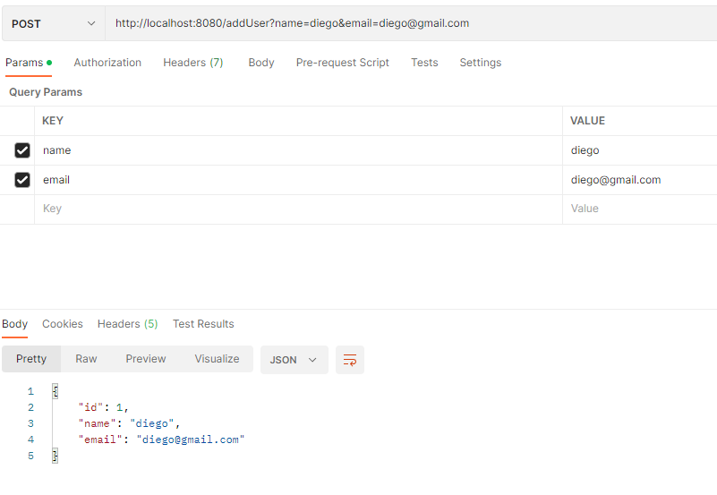

### Escuela Colombiana de Ingeniería

### IETI - Spring Boot con Postgres

### Autor: Diego Leon

#### Descripción

- Agregamos un nuevo usuario a la base de datos

- Se puede observar que el usuario se agrego correctamente en el hibernate

- Se observan los datos del usuario en la base de datos

- Se hace get a la base de datos para obtener el usuario en especifico

- Se observa como hace el select en la base de datos en el hibernate

- Se reinicia el programa y se observa que el usuario se encuentra en la base de datos

